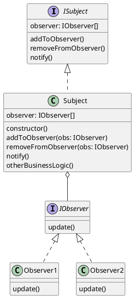

# Observer Design pattern

observer design pattern is a behavioral design pattern that lets you define a subscription mechanism to notify multiple objects about any events that happen to the object they are observing.

- **one thing to not about this pattern would be subscribers are notified in random order**
  
- Observer pattern adherese with encapsulating what changes design prinicple by isolating the logic that changes often to the subject or if we add new subscribers often it isolates the change to a single subscriber.
  
- This pattern also helps us to adhere to program to an interface not implementations by making our publisher(subject) totally unaware of any concrete subscriber/observer only just the interface.
  
- This pattern also helps us to adhere to Favor composition over inheritance rule by allowing us to dynamically inject subscribers/observers to our subjects/publishers. So the subject/publisher knows about the observers by interface but the life time of the observers is not manager by the subject/publisher